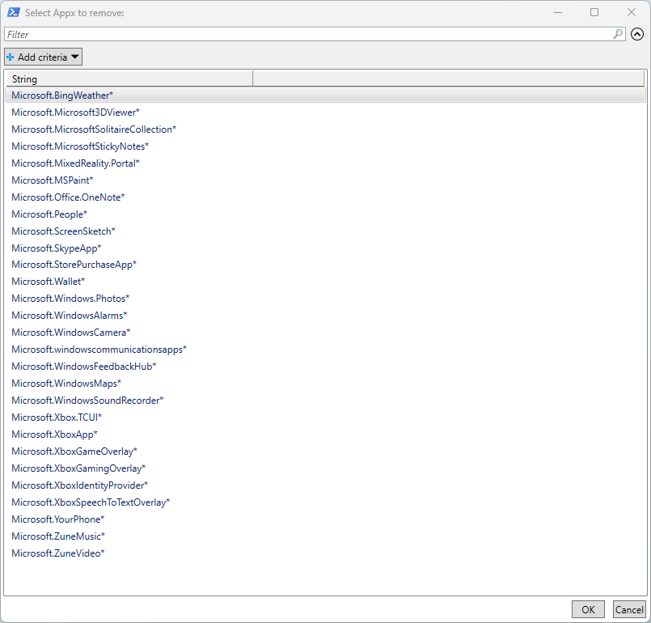

# RemoveBloatware

### Description

This script removes all useless APPX applications from the operating system.

List of deleted applications

```
Microsoft.BingWeather
Microsoft.BingSearch
Microsoft.BingNews
Microsoft.Microsoft3DViewer
Microsoft.MicrosoftSolitaireCollection
Microsoft.MicrosoftStickyNotes
Microsoft.MixedReality.Portal
Microsoft.MSPaint
Microsoft.Paint
Microsoft.Office.OneNote
Microsoft.OutlookForWindows
Microsoft.MicrosoftOfficeHub
Microsoft.People
Microsoft.ScreenSketch
Microsoft.SkypeApp
Microsoft.StorePurchaseApp
Microsoft.Wallet
Microsoft.WindowsAlarms
Microsoft.WindowsCamera
Microsoft.windowscommunicationsapps
Microsoft.WindowsFeedbackHub
Microsoft.WindowsMaps
Microsoft.Windows.DevHome
MicrosoftWindows.CrossDevice
Microsoft.WindowsSoundRecorder
Microsoft.Xbox.TCUI
Microsoft.XboxApp
Microsoft.XboxGameOverlay
Microsoft.XboxGamingOverlay
Microsoft.XboxIdentityProvider
Microsoft.XboxSpeechToTextOverlay
Microsoft.YourPhone
Microsoft.ZuneMusic
Microsoft.ZuneVideo
Microsoft.GetHelp
Microsoft.Todos
Microsoft.Copilot
Microsoft.PowerAutomateDesktop
MicrosoftCorporationII.QuickAssist
Clipchamp.Clipchamp
```

### Usage

Copy the code from the area below and paste it into PowerShell Admin (or Windows Terminal) and press Enter.

```powershell
Set-ExecutionPolicy Bypass -Scope Process -Force; [System.Net.ServicePointManager]::SecurityProtocol = [System.Net.ServicePointManager]::SecurityProtocol -bor 3072; Invoke-Expression ((New-Object System.Net.WebClient).DownloadString('https://raw.githubusercontent.com/UsefulScripts01/RemoveAppx/main/RemoveAppx.ps1'))
```

<br>

Select Appx Packages to remove


